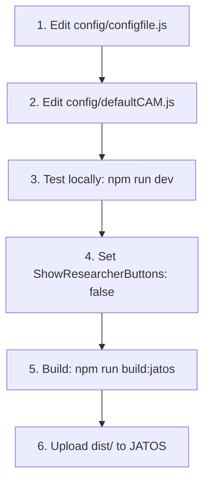

# CAM DCT (Vite + JATOS)

This project is a browser-based study tool for collecting Cognitive-Affective Maps (CAMs). It is built with Vite, which turns the source files into a static website you can test locally or upload to JATOS.

The instructions below are written for non-web developers and include every command you need to type.

## Study workflow (overview)



## Prepare your study (step by step)

Before building for JATOS, configure your study in the source files and test locally. The steps below match the workflow diagram above.

| Step | Action | File / command |
|------|--------|----------------|
| 1 | Set study rules (language, limits, features) | [`config/configfile.js`](config/configfile.js) — edit the block between `/* MAKE CHANGES: start*/` and `/* MAKE CHANGES: end*/` |
| 2 | Define the starting CAM (predefined concepts, fixed positions) | [`config/defaultCAM.js`](config/defaultCAM.js) — edit the block between `/* MAKE CHANGES: start*/` and `/* MAKE Changes: end*/` |
| 3 | Preview locally | `npm install` then `npm run dev` |
| 4 | Hide researcher UI for participants | In `configfile.js`, set `ShowResearcherButtons: false` |
| 5 | Build static files for JATOS | `npm run build:jatos` → output in `dist/` |
| 6 | Deploy to JATOS | See [JATOS 3.8.x+ setup](#jatos-38x-setup-step-by-step) below |

### Official documentation

For detailed explanations of each config parameter, the CAM data structure, and implemented features, see the [Data Collection Tool documentation](https://camtools-documentation.readthedocs.io/en/master/Data%20Collection%20Tool/) — in particular [Define your config file](https://camtools-documentation.readthedocs.io/en/master/Data%20Collection%20Tool/#define-your-config-file).

The online docs describe configuring a study via the administrative panel (researcher view, gear icon, export). **In this repository**, the equivalent is editing [`config/configfile.js`](config/configfile.js) and [`config/defaultCAM.js`](config/defaultCAM.js) directly, then rebuilding.

## Study configuration (`config/configfile.js`)

Edit the `config` object in [`config/configfile.js`](config/configfile.js). Common parameters:

| Parameter | Meaning | Typical values |
|-----------|---------|----------------|
| `MinNumNodes` | Minimum concepts before a participant can save | 1–50 |
| `MaxNumWords` | Maximum words per concept (1–3 recommended for aggregation) | 1–52 |
| `MaxLengthChars` | Maximum characters per concept | 30–300 |
| `enableArrows` | Directed connections (see inverted flags below) | `true` / `false` |
| `BidirectionalDefault` | Default connector is bidirectional (only if arrows enabled) | `true` / `false` |
| `OnlyStraightCon` | Supporting connections only (agreement slider) | `true` / `false` |
| `enableAmbivalent` | Ambivalent concepts (see inverted flags below) | `true` / `false` |
| `cameraFeature` | Spotlight / move-screen feature at screen edges | `true` / `false` |
| `fullScreen` | Fullscreen mode + paradata (focus/defocus events) | `true` / `false` |
| `setLanguage` | Interface language | `"English"`, `"German"`, `"Spanish"`, `"Chinese"` |
| `ShowResearcherButtons` | Researcher toolbar (gear, export, etc.) | `true` while developing; `false` for participants |
| `CAMproject` | Project name (internal identifier) | e.g. `"projectName"` |
| `AdaptiveStudy` | Enable adaptive study flow | `true` / `false` |
| `ADAPTIVESTUDYurl` | URL for adaptive study data | your endpoint URL |

### Inverted boolean flags

Some flags use **inverted logic** in the config file (`false` means the feature is **enabled**). This matches the comments in `configfile.js` and the researcher export UI.

| Official docs: feature ON | Value in `configfile.js` |
|---------------------------|--------------------------|
| Arrows ON | `enableArrows: false` |
| Ambivalent concepts ON | `enableAmbivalent: false` |

`defaultFlags.usingJATOS` is already `true` for JATOS builds. With `usingSupabase: false` (default), the starting CAM is loaded from [`config/defaultCAM.js`](config/defaultCAM.js) (see [`src/js/backend/initialisation.js`](src/js/backend/initialisation.js)).

## Default CAM (`config/defaultCAM.js`)

When Supabase is not used, `defaultCAM()` runs on study load and when a participant deletes the CAM (see [`src/js/frontend/buttons/participant/deleteButton.js`](src/js/frontend/buttons/participant/deleteButton.js)). Use this file to predefine concepts, positions, and locks.

### Adding a concept (node)

```js
store.cam.addElement(new NodeCAM(value, text, { x, y }, isDraggable, isDeletable, isTextChangeable));
```

| Argument | Meaning |
|----------|---------|
| `value` | Valence from -3 to 3 (`0` = neutral; ambivalent shape uses value `10` internally) |
| `text` | Label shown on the concept |
| `{ x, y }` | Position on the drawing board |
| `isDraggable` | `false` = participant cannot move the concept |
| `isDeletable` | `false` = participant cannot delete the concept |
| `isTextChangeable` | `false` = participant cannot edit the text |

Minimal example (fixed central concept):

```js
store.cam.addElement(new NodeCAM(0, "Central Concept", { x: 650, y: 400 }, false, false, false));
```

For multiple concepts and connectors, see the commented example in [`config/defaultCAM.js`](config/defaultCAM.js) (`ConnectorCAM` + `establishConnection`). See also [Implemented features](https://camtools-documentation.readthedocs.io/en/master/Data%20Collection%20Tool/#implemented-features) in the official docs.

## What is Vite (simple explanation)

Vite is a tool that does two things:

1. **Development server**: Starts a local website on your computer so you can test changes quickly.
2. **Production build**: Creates a folder of static files (HTML, JS, CSS) that can be uploaded to servers like JATOS.

In this project, the production build is created in the `dist/` folder.

## Prerequisites

- Node.js (includes npm)
- Git (optional, only if you want to clone the repository)

Check that Node.js and npm are installed:

```bash
node --version
npm --version
```

## Get the project (if you do not have it yet)

If you already have the project folder, skip this step.

```bash
git clone https://github.com/FennStatistics/CAM_DataCollectionTool_2.git
cd <project-folder>
```

## Install dependencies

```bash
npm install
```

## Run locally (for quick checks)

Start the development server (step 3 in the workflow above):

```bash
npm run dev
```

Vite will print a local URL (usually `http://localhost:5173`). Open that in your browser.

## Build for JATOS

**Only run this after you have edited the config files (steps 1–2) and tested locally (step 3).** Set `ShowResearcherButtons: false` before building for participants (step 4).

This project uses a special build mode that injects `jatos.js` into `index.html` so JATOS can provide study data.

```bash
npm run build:jatos
```

The build output is in:

```
dist/
```

## JATOS 3.8.x+ setup (step by step)

Workflow step 6: deploy the `dist/` folder to JATOS.

### 1) Start JATOS locally

If you already have a running JATOS server, skip this step.

Download JATOS from the official site (https://www.jatos.org/Installation.html), unzip it, then run:

macOS / Linux:

```bash
cd /path/to/jatos
./start-jatos.sh
```

Windows (PowerShell):

```powershell
cd C:\path\to\jatos
start-jatos.bat
```

Open the JATOS UI in your browser (default is usually `http://localhost:9000`).

### 2) Create a new study

In the JATOS UI:

1. Go to **Studies**.
2. Click **New Study**.
3. Give it a name and create it.

### 3) Create a component and upload the build

In your new study:

1. Click **New Component**.
2. Choose **HTML** as the component type.
3. Upload the files from `dist/`.

Important: upload the **contents** of `dist/` (including `index.html`), not the `dist/` folder itself.

### 4) Set the HTML entry file

In the component settings:

1. Set the **HTML file** (entry point) to:

```
index.html
```

2. Save the component.

### 5) Export the study as `.jzip`

In JATOS 3.8.x or higher:

1. Open the study overview.
2. Use the **Study** menu and choose **Export**.
3. Download the `.jzip` file.

### 6) Upload the `.jzip` to a server accessible via internet

On the target JATOS server (internet-accessible):

1. Sign in to that JATOS instance.
2. Go to **Studies**.
3. Choose **Import Study** and upload the `.jzip` file.
4. After import, open the study and run it.

## Common pitfalls (quick fixes)

- **Forgot to edit config before build**: changes to `configfile.js` or `defaultCAM.js` are baked in at build time. Rebuild and re-upload:

```bash
npm run build:jatos
```

- **Researcher buttons visible to participants**: set `ShowResearcherButtons: false` in `configfile.js` before `npm run build:jatos`.

- **Arrows or ambivalent concepts not working as expected**: check the [inverted boolean flags](#inverted-boolean-flags) — `false` often means the feature is enabled.

- **Study loads but JATOS features are missing**: make sure you ran the JATOS build:

```bash
npm run build:jatos
```

- **Blank page or 404 inside JATOS**: you likely uploaded the `dist/` folder itself. Upload the *contents* of `dist/` instead (including `index.html`).

- **Changes not showing up**: rebuild and re-upload the `dist/` files.

## Useful commands (all in one place)

```bash
npm install
npm run dev
npm run build
npm run build:jatos
npm run preview
```

## Access your CAM in the browser console

During local development (`npm run dev`), you can inspect the live CAM object. In older versions the global was `CAM`; now it lives in `store.cam`. See [Data-structure of CAMs](https://camtools-documentation.readthedocs.io/en/master/Data%20Collection%20Tool/#data-structure-of-cams) for field descriptions.

```javascript
import("/src/js/app/store.js").then(({ store }) => {
    window.CAM_get = store.cam;
    console.log(CAM_get.nodes);
});
```

After running this once, `CAM_get.nodes` and `CAM_get.connectors` are available for the rest of the session. This dynamic import only works in dev mode, not in a production/JATOS build.

## Cite our software

If you use these materials, please cite the article (see [CITATION.cff](CITATION.cff) for machine-readable metadata):

> Fenn, J., Gouret, F., Gorki, M., Reuter, L., Gros, W., Hüttner, P., & Kiesel, A. (2025). Cognitive-affective maps extended logic: Proposing tools to collect and analyze attitudes and belief systems. _Behavior Research Methods, 57_(6), 174. https://doi.org/10.3758/s13428-025-02699-y

BibTeX:

```bibtex
@article{fenn2025camel,
  author  = {Fenn, Julius and Gouret, Florian and Gorki, Michael and Reuter, Lisa and Gros, Wilhelm and H{\"u}ttner, Paul and Kiesel, Andrea},
  title   = {Cognitive-affective maps extended logic: Proposing tools to collect and analyze attitudes and belief systems},
  journal = {Behavior Research Methods},
  year    = {2025},
  volume  = {57},
  number  = {6},
  pages   = {174},
  doi     = {10.3758/s13428-025-02699-y},
  url     = {https://doi.org/10.3758/s13428-025-02699-y}
}
```
